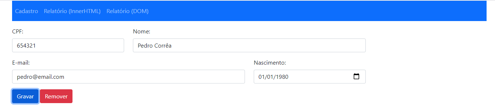

# APLICAÇÃO FRONT-END DE EXEMPLO

Autor: Prof. Fabiano Costa Teixeira

## Resumo

Essa é uma aplicação front-end que realiza a persistência de dados utilizando a LocalStorage. São disponibilizados recursos para cadastro e recuperação dos dados.

## Linguagens e Frameworks

São utilizados nesse exemplo as seguintes linguagens e frameworks:
<ul>
  <li>HTTML</li>
  <li>CSS</li>
  <li>Javascript</li>
  <li>Bootstrap</li>
</ul>

## Funcionamento Básico

A aplicação possui um menu superior para navegação onde são encontradas as opções:
<ul>
  <li>Cadastro: realiza a inserção ou atualização de dados na LocalStorage</li>
  <li>Relatório (InnerHTML): realiza a busca dos dados na LocalStorage e atualiza a tabela por meio da geração de um trecho de HTML contendo o corpo da tabela. Esse trecho de HTML é atualizado por meio do InnerHTML</li>
  <li>Relatório (DOM): realiza a busca dos dados na LocalStorage e atualiza a tabela por meio da manipulação da árvore DOM, onde são criados e inseridos novos elementos <TR>, <TD> e <A></li>
</ul>
    
 Na imagem abaixo é apresentada a tela de cadastro.
 
 
 
 Nessa tela há um evento <i>onblur</i> (executando quando o foco deixa um determinado campo) no "input" CPF. Esse evento invoca uma função que faz uma busca na LocalStorage para verificar se aquele CPF já está cadastrado. Se estiver, os dados são recuperados e apresentados na interface para atualização. É também apresentado um botão "remover" que permite a exclusão do cadastro.
 
 Caso o CPF não seja encontrado, entende-se como um novo cadastro. Então, os demais campos são deixados em branco para receber os dados do usuário e o botão remover torna-se inacessível.
